# Project Report — Fingerprint Spoofing Detection

**Author:** Nicola Ciancia
**Course:** Machine Learning and Pattern Recognition
**Date:** 2026-05-20

---

## 0. Executive summary

The project task is a **binary classification** problem for fingerprint
spoofing detection. The dataset (`Project/data/trainData.txt`) contains
6000 samples, each described by 6 real-valued features, with binary
labels:

- **0 = fake** (impostor, counterfeit)
- **1 = genuine** (legitimate user)

The dataset is nearly balanced (2990 fake / 3010 genuine).

The whole project pipeline uses a **deterministic 2/3 vs 1/3 split** with
seed=0 (`utils/data_utils.py::split_db_2to1`), yielding:

- DTR / LTR: 4000 model-training samples (empirical π₁ ≈ 0.5005)
- DVAL / LVAL: 2000 validation samples

The **target application**, fixed from Lab 6 onwards, is
π̃ = 0.1, C_fn = C_fp = 1 (the "many impostors" case: accepting a fake
is penalized more strongly).

All reported results come from the scripts in
[experiments/](../experiments/) and the text logs in [out/](../out/).
The full-resolution plots are in [out/plots/](../out/plots/); copies of
those used in this report are included in [images/](images/).

**Summary of the best results on DVAL (π̃ = 0.1):**

| Family | Best model | minDCF | actDCF |
|---|---|---:|---:|
| Generative Gaussian | MVG (all features) | 0.2629 | 0.3051 |
| Logistic Regression | Quadratic LR (λ ≈ 3.2·10⁻²) | **0.2436** | 0.4972 |
| SVM | RBF SVM (γ = e⁻², C = 32) | **0.1725** | 0.4226 |
| GMM | Full-cov GMM (K₀=1, K₁=16) | **0.1495** | 0.2055 |

The winning model in terms of minDCF is the **full-covariance GMM** with
1 component for the fake class and 16 for the genuine class. This result
is perfectly consistent with the exploratory structure of the dataset
(cf. §1 and §2): the fake class is essentially uni-modal, while the
genuine class is multi-modal (4 clusters on features 5-6).

---

## 1. Lab 2 — Exploratory data analysis

### 1.1 Method

The script [experiments/lab02_iris_dataset.py](../experiments/lab02_iris_dataset.py):

1. Loads `data/trainData.txt` via `data_utils.load`, producing
   `D ∈ ℝ^(6 × 6000)` and `L ∈ ℤ^6000`.
2. Computes per-class means and covariances via
   `utils/math_utils.py::compute_mu_C`.
3. Produces 6 normalized histograms (one per feature, two classes
   overlaid with `alpha=0.45`) and 15 scatter plots for all pairs i<j
   (`plot_utils.plot_scatter`).
4. For each pair of features 1-2, 3-4, 5-6, prints the difference of
   means |Δμ| and of variances |Δσ²|.

### 1.2 Per-class statistics

| Class | μ₁ | μ₂ | μ₃ | μ₄ | μ₅ | μ₆ |
|---|---:|---:|---:|---:|---:|---:|
| 0 (fake) | +0.0029 | +0.0187 | **−0.6809** | **+0.6708** | +0.0280 | −0.0058 |
| 1 (genuine) | +0.0005 | −0.0085 | **+0.6652** | **−0.6642** | −0.0417 | +0.0239 |

| Class | σ²₁ | σ²₂ | σ²₃ | σ²₄ | σ²₅ | σ²₆ |
|---|---:|---:|---:|---:|---:|---:|
| 0 (fake) | 0.570 | **1.421** | 0.550 | 0.536 | 0.680 | 0.705 |
| 1 (genuine) | **1.430** | 0.578 | 0.549 | 0.553 | **1.318** | **1.287** |

### 1.3 Answers to the Lab 2 project questions

**Q1 — Features 1 and 2.**
The class means are very similar (|Δμ| ≈ 0.002 and 0.027 respectively —
essentially identical). What changes drastically are the
**variances**: for feature 1 the genuine class has variance 1.43 vs 0.57
for fake (|Δσ²| ≈ 0.86); for feature 2 the ratio is reversed
(1.42 vs 0.58). The classes overlap heavily, and from the histograms it
is clear that both are **uni-modal** (a single "peak"), symmetric and
centered around zero. Discrimination on these features is entirely due
to the "scale" of the distributions: the tails of the genuine class are
wider.

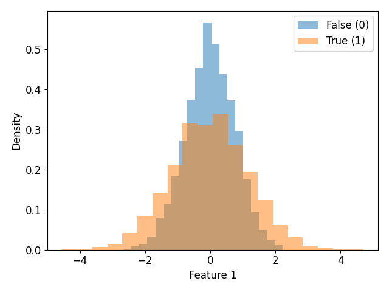

**Q2 — Features 3 and 4.**
Here the situation is reversed: |Δμ| ≈ 1.35 for both features 3 and 4,
while the variances are virtually identical between the two classes
(≈ 0.54). The two classes separate well by mean shift. The histograms
show two shifted, uni-modal Gaussians. These are the most informative
features in a "linear-mean-based" sense.

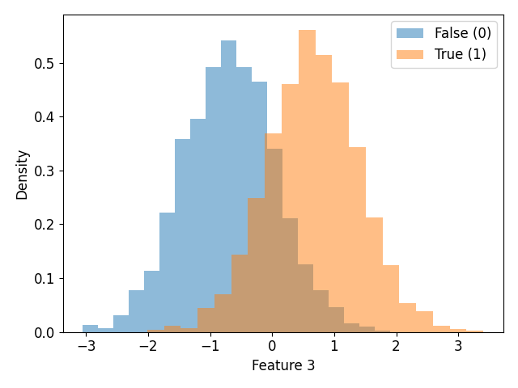

**Q3 — Features 5 and 6.**
The histograms show a radically different behavior: the genuine class
is clearly **bi-modal** (two symmetric peaks around ±1), while the fake
class remains uni-modal and concentrated around 0. The 5-6 scatter plot
shows that the genuine class forms **4 clusters** arranged in a
"square" around the origin, while the fake class concentrates in a
single central cluster with tails filling the space. These are
non-Gaussian features with a sub-categorical structure → very strong
motivation for a GMM with 4+ components on class 1.

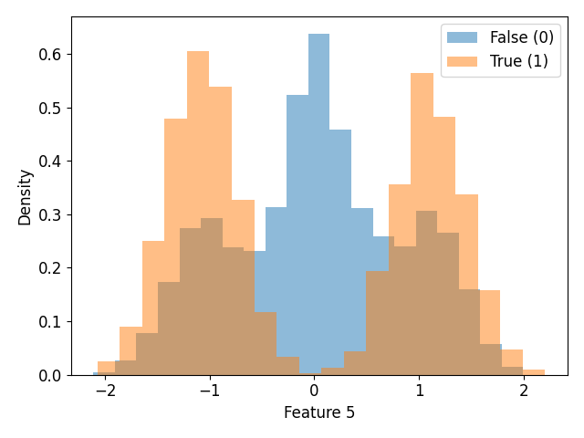
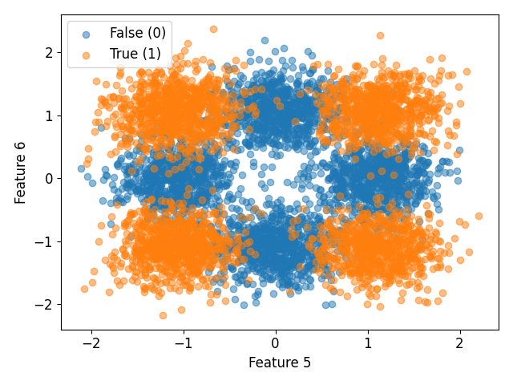

### 1.4 Implications for the subsequent models

- Features 1-2 → a classifier based on means only (Tied MVG, LDA,
  linear LR) **cannot** discriminate them. Models sensitive to
  different per-class covariances are required (MVG full, QDA, kernel
  SVM, GMM).
- Features 3-4 → discriminable even with "very poor" models such as
  Tied/LDA.
- Features 5-6 → the multi-cluster structure justifies a priori why a
  GMM with many components will win.

---

## 2. Lab 3 — Dimensionality reduction (PCA and LDA)

### 2.1 Method

Script [experiments/lab03_dimensionality_reduction.py](../experiments/lab03_dimensionality_reduction.py), using:
- [models/pca.py](../models/pca.py) — `compute_pca(D, m)` computes the
  eigenvectors of the data covariance via SVD.
- [models/lda.py](../models/lda.py) — computes `S_B` (between-class) and
  `S_W` (within-class) and solves `scipy.linalg.eigh(S_B, S_W)`
  (generalized eigenvalue problem).

**LDA classification pipeline (binary):**

1. Estimate `U_lda` on `(DTR, LTR)`.
2. Project `DTR → DTR_lda`, `DVAL → DVAL_lda`.
3. **Fix orientation** so that `μ_lda[class 0] > μ_lda[class 1]`
   (CLAUDE.md convention: our LLR is log p(x|1) − log p(x|0); we flip
   the sign if needed for consistency).
4. Threshold "mean of means": `t = (μ_lda₀ + μ_lda₁) / 2`.
5. Predict 0 if projection ≥ t, 1 otherwise.

### 2.2 PCA results (from the log)

| PCA direction | μ class 0 | σ class 0 | μ class 1 | σ class 1 | \|Δμ\| |
|---|---:|---:|---:|---:|---:|
| 1 (principal) | −0.955 | 0.731 | +0.940 | 0.739 | **1.895** |
| 2 | −0.029 | 0.802 | +0.018 | 1.176 | 0.046 |
| 3 | +0.034 | 1.029 | −0.021 | 0.973 | 0.055 |
| 4 | +0.034 | 0.992 | −0.045 | 1.001 | 0.079 |
| 5 | +0.011 | 0.830 | +0.005 | 1.129 | 0.005 |
| 6 | −0.000 | 0.745 | +0.007 | 0.750 | 0.007 |

Only the first PCA direction has discriminative power (|Δμ| ≈ 1.9),
because it concentrates the information from features 3-4 (the only
ones with markedly different means between classes). The other
directions have practically coincident means — the between-class
difference is almost entirely in the covariance, which PCA does not see.

**Key observation (asked by the PDF):** PCA with m=6 is just a
rotation: the clusters (e.g. those in features 5-6) remain the same,
just in different coordinates. The post-PCA histograms and scatters
"look" different but the distances between points are invariant.

### 2.3 LDA results

LDA 1-D (maximum number of directions for a binary problem):

| | μ class 0 | σ class 0 | μ class 1 | σ class 1 | \|Δμ\| |
|---|---:|---:|---:|---:|---:|
| LDA direction 1 | +1.308 | 0.996 | −1.287 | 1.004 | **2.595** |

|Δμ| = 2.6 is significantly larger than for the first PCA direction
(1.9): LDA "pushes" the classes further apart by exploiting S_B/S_W
rather than only the total variance.

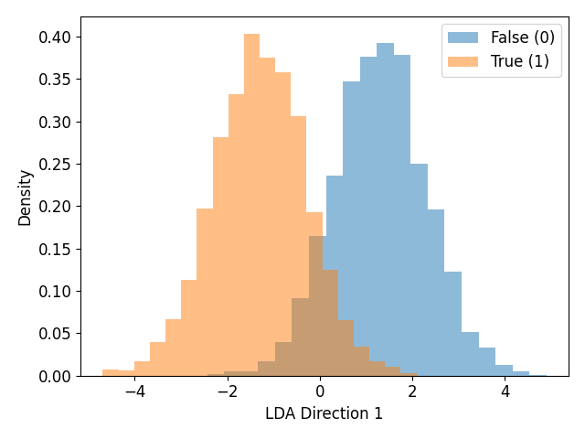

### 2.4 LDA-based classification

| Configuration | Errors | Error rate |
|---|---:|---:|
| "Mean of means" threshold | 186 / 2000 | **9.30 %** |
| Optimal threshold on DVAL (sweep) | 182 / 2000 | 9.10 % |
| improvement | 4 | 0.20 % |

PCA pre-processing + LDA (m = number of PCA components kept):

| m | Errors | Error rate |
|---|---:|---:|
| 1 | 187 | 9.35 % |
| 2 | 185 | 9.25 % |
| 3 | 185 | 9.25 % |
| 4 | 185 | 9.25 % |
| 5 | 186 | 9.30 % |
| 6 (no PCA) | 186 | 9.30 % |

### 2.5 Answers to the Lab 3 project questions

- **PCA effects**: only the first direction discriminates; the other 5
  carry "scale" information that PCA, being unsupervised, cannot use.
  No new clusters become visible because PCA is a rotation of the
  reference frame. There is no "more separation".
- **Is LDA finding a good direction?** Yes: with mean-of-means threshold
  we get 9.30 % error rate — the recurring reference figure for all
  subsequent labs (CLAUDE.md sanity check).
- **Does changing the threshold help?** Marginally: only from 9.30 %
  to 9.10 % (4 fewer errors). The best threshold found (−0.107) is not
  far from the default (−0.019).
- **Is PCA pre-processing + LDA beneficial?** No, not significantly:
  results stay in [9.25 %, 9.35 %]. PCA does not help because:
  1. The problem is not high-dimensional (M=6 is already small).
  2. LDA is already supervised and gains nothing from an unsupervised
     pre-rotation.

---

## 3. Lab 4 — Density estimation (1-D Gaussian fit)

### 3.1 Method

Script [experiments/lab04_density_estimation.py](../experiments/lab04_density_estimation.py).

For each of the 6 features and each of the 2 classes:

1. ML estimate: `μ_ML = (1/N) Σ x_i`,
   `σ²_ML = (1/N) Σ (x_i - μ_ML)²`.
2. Plot the normalized histogram and overlay the fitted Gaussian.

The script outputs a table of the estimates and 6 plots
(`feature_1.png` … `feature_6.png`).

### 3.2 Per-class, per-feature ML estimates

| Feature | Class | μ_ML | σ²_ML |
|---:|---:|---:|---:|
| 1 | 0 | +0.0029 | 0.5696 |
| 1 | 1 | +0.0005 | 1.4302 |
| 2 | 0 | +0.0187 | 1.4209 |
| 2 | 1 | −0.0085 | 0.5783 |
| 3 | 0 | −0.6809 | 0.5500 |
| 3 | 1 | +0.6652 | 0.5489 |
| 4 | 0 | +0.6708 | 0.5360 |
| 4 | 1 | −0.6642 | 0.5533 |
| 5 | 0 | +0.0280 | 0.6801 |
| 5 | 1 | −0.0417 | 1.3178 |
| 6 | 0 | −0.0058 | 0.7050 |
| 6 | 1 | +0.0239 | 1.2870 |

### 3.3 Answers to the Lab 4 project questions

- **For which features is the Gaussian fit good?** Features
  **1-2-3-4** are reasonably Gaussian: histograms show a single,
  approximately symmetric mode, and the Gaussian curve follows the
  shape well.

  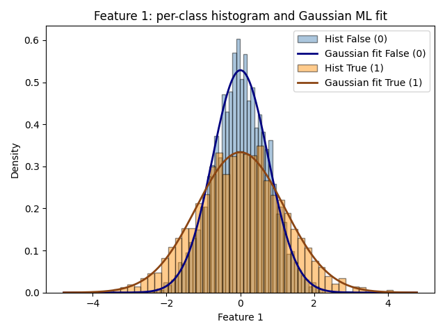
  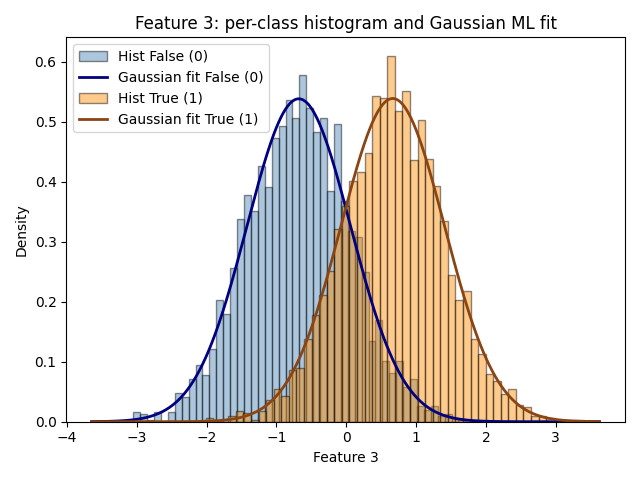

- **For which features is the fit poor?** Features **5-6**: the
  histogram of the genuine class (label 1) is clearly **bimodal**, with
  two symmetric peaks around ±1, and a Gaussian centered at zero with
  large variance is a very poor approximation. The fitted Gaussian
  "smears" across both peaks without capturing them.

  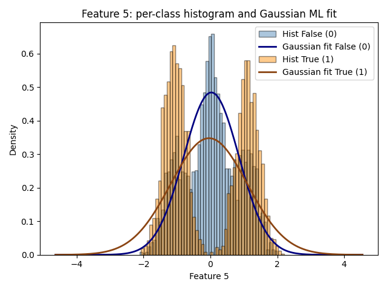

- **Consequence for Gaussian models:** we expect single-Gaussian
  models (MVG, Naive Bayes, Tied) to underperform compared to a GMM,
  especially when features 5-6 are included. This is confirmed in §4
  (Lab 5): MVG on features 1-4 gets 7.95 % error, MVG on all 6 features
  7.00 % — the gain is marginal because a full-covariance MVG struggles
  with multimodal features, but the inter-feature covariance helps. The
  real quality jump comes with GMM (§8).

---

## 4. Lab 5 — Generative Gaussian classifiers

### 4.1 Method

Script [experiments/lab05_gaussian_classification.py](../experiments/lab05_gaussian_classification.py), using [models/gaussian_models.py](../models/gaussian_models.py):

- **MVG** (`Gau_MVG_ML_estimates`): one `(μ_c, Σ_c)` per class.
- **Naive Bayes** (`Gau_Naive_ML_estimates`): as MVG but `Σ_c ← Σ_c ⊙ I`
  (diagonal only).
- **Tied** (`Gau_Tied_ML_estimates`): `μ_c` per class but shared
  `Σ = (1/N) Σ_c N_c Σ_c*`.

**Inference** (`compute_llr`):
\[ \mathrm{llr}(x) = \log \mathcal{N}(x|\mu_1, \Sigma_1) - \log \mathcal{N}(x|\mu_0, \Sigma_0) \]
using `logpdf_GAU_ND` for numerical stability. Prediction: 1 if
llr ≥ 0, 0 otherwise (uniform priors).

### 4.2 Covariances and Pearson correlations

The **full covariances** of the two classes (summary of the output):

Class 0 (fake), diagonal: [0.60, 1.45, 0.57, 0.54, 0.70, 0.69]
Class 1 (genuine), diagonal: [1.45, 0.55, 0.56, 0.57, 1.34, 1.30]

Off-diagonal terms are all of order 10⁻² or smaller, **orders of
magnitude smaller** than the diagonal variances.

**Pearson correlation** (maximum off-diagonal value):
- Class 0: ≤ 0.034 (essentially zero).
- Class 1: maximum 0.049 between features 3-4.

**Consequence:** features are essentially **uncorrelated** within each
class. This is why Naive Bayes (which ASSUMES diagonal covariance) has
performance equal or close to MVG: the assumption is largely true on
the data.

### 4.3 Classification results (error rate on DVAL)

**All 6 features:**

| Model | Error rate |
|---|---:|
| MVG | **7.00 %** |
| Naive Bayes | 7.20 % |
| Tied | 9.30 % |

**Features 1-4 only (dropping non-Gaussian 5-6):**

| Model | Error rate |
|---|---:|
| MVG | 7.95 % |
| Naive Bayes | 7.65 % |
| Tied | 9.50 % |

**Features 1-2 only (similar means, different variances):**

| Model | Error rate |
|---|---:|
| MVG | 36.50 % |
| Naive Bayes | 36.30 % |
| Tied | **49.45 %** |

**Features 3-4 only (different means, similar variances):**

| Model | Error rate |
|---|---:|
| MVG | 9.45 % |
| Naive Bayes | 9.45 % |
| Tied | 9.40 % |

**PCA + classifiers (on the 6 original features):**

| m | MVG | Naive Bayes | Tied |
|---:|---:|---:|---:|
| 1 | 9.25 % | 9.25 % | 9.35 % |
| 2 | 8.80 % | 8.85 % | 9.25 % |
| 3 | 8.80 % | 9.00 % | 9.25 % |
| 4 | 8.05 % | 8.85 % | 9.25 % |
| 5 | 7.10 % | 8.75 % | 9.30 % |
| 6 | 7.00 % | 8.90 % | 9.30 % |

### 4.4 Answers to the Lab 5 project questions

- **Which model is best?** The **full MVG** on the 6 features (7.00 %).
  Tied is clearly worse (9.30 %) because it imposes a shared covariance
  across classes, but we know from Lab 2 that the variances of features
  1, 2, 5, 6 are **very different** between classes: Tied loses this
  information.
- **Naive Bayes vs MVG:** essentially on par (7.20 % vs 7.00 %) because
  features are nearly uncorrelated (Pearson < 0.05). The diagonality
  assumption is nearly true.
- **Goodness of the Gaussian assumption:** from Lab 4 we know features
  5-6 are bimodal → the assumption is violated. Yet dropping 5-6 makes
  results worse (MVG goes from 7.00 % to 7.95 %). This means that even
  if a single Gaussian does not perfectly model those features, the
  "scale" information (different variance per class) is still useful.
- **Features 1-2 (different variances):** MVG and Naive work (≈36 %,
  still high because separation is variance-only); Tied collapses to
  49 % (random for a binary problem): with nearly equal means and a
  tied covariance, the two classes become indistinguishable.
- **Features 3-4 (different means):** All three models get ≈9.4 %,
  because using the means is enough and variances are similar — Tied is
  not penalized.
- **PCA + Gaussian:** PCA does not improve MVG (7.00 % at m=6, 7.10 %
  at m=5). No benefit. Naive Bayes worsens slightly with PCA (PCA
  reintroduces correlation in the new features, violating the naive
  assumption). Tied is unaffected.

**Sanity check (CLAUDE.md):** ✓ MVG 7.00 %, Naive 7.20 %, Tied 9.30 %;
subset 1-4: 7.95 % / 7.65 % / 9.50 %. All expected values are met.

---

## 5. Lab 6 — Bayesian decisions and model evaluation

### 5.1 Theoretical framework

**Cost matrix** for a binary task:
\[ \mathbf{C} = \begin{pmatrix} 0 & C_{fn} \\ C_{fp} & 0 \end{pmatrix} \]

**Optimal decision threshold:**
\[ t = -\log\!\frac{\pi_1 C_{fn}}{(1-\pi_1) C_{fp}} \]
Predict class 1 if llr > t.

**Effective prior:**
\[ \tilde{\pi} = \frac{\pi_1 C_{fn}}{\pi_1 C_{fn} + (1-\pi_1) C_{fp}} \]
An application `(π₁, C_fn, C_fp)` is, in terms of threshold, equivalent
to `(π̃, 1, 1)`.

**Normalized DCF:**
\[ \mathrm{DCF} = \frac{\pi_1 C_{fn} P_{fn} + (1-\pi_1) C_{fp} P_{fp}}{\min(\pi_1 C_{fn}, (1-\pi_1) C_{fp})} \]

- **actDCF**: DCF using the theoretical threshold t.
- **minDCF**: minimum DCF over all possible thresholds (lower bound;
  measures pure "separability" independent of calibration).
- **Calibration loss** = actDCF − minDCF.

Implementation in [utils/evaluation.py](../utils/evaluation.py):
- `compute_optimal_Bayes_binary_llr(llr, prior, Cfn, Cfp)` computes the
  theoretical threshold and decisions.
- `compute_minDCF_binary_fast` sorts the scores and computes all
  possible Pfn/Pfp in O(N log N).
- `compute_actDCF_binary_fast = compute_empirical_Bayes_risk_binary_llr_optimal_decisions`.

### 5.2 Applications considered

The Lab 6 PDF asks to evaluate 5 applications and convert them to
effective priors:

| `(π₁, C_fn, C_fp)` | π̃ |
|---|---:|
| (0.5, 1, 1) | 0.5 |
| (0.9, 1, 1) | 0.9 |
| (0.1, 1, 1) | 0.1 |
| (0.5, 1, 9) — strong security | 0.1 |
| (0.5, 9, 1) — ease of use | 0.9 |

**Interpretation:** increasing C_fp (penalty for false positives =
accepting a fake) lowers the effective prior of genuine. "Strong
security" (π̃=0.1) is equivalent, decision-wise, to the "many
impostors" application (π₁=0.1). The three canonical effective priors
we examine from now on are **0.1, 0.5, 0.9**.

### 5.3 DCF results for the three Gaussian models

| Model | π̃ | actDCF | minDCF | cal-loss |
|---|---:|---:|---:|---:|
| MVG | 0.1 | 0.3051 | 0.2629 | 0.0422 |
| Naive Bayes | 0.1 | 0.3022 | 0.2570 | 0.0452 |
| Tied | 0.1 | 0.4061 | 0.3628 | 0.0432 |
| **MVG** | **0.5** | **0.1399** | **0.1302** | **0.0098** |
| Naive Bayes | 0.5 | 0.1439 | 0.1311 | 0.0128 |
| Tied | 0.5 | 0.1860 | 0.1812 | 0.0048 |
| MVG | 0.9 | 0.4001 | 0.3423 | 0.0577 |
| Naive Bayes | 0.9 | 0.3893 | 0.3510 | 0.0383 |
| Tied | 0.9 | 0.4626 | 0.4421 | 0.0204 |

### 5.4 Bayes Error Plot

Plot with `prior log-odds ∈ [-4, +4]`, one column for each of the 3
models:

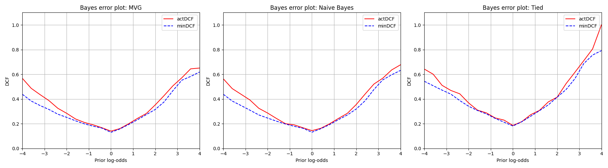

### 5.5 Answers to the Lab 6 project questions

- **Which model is best in minDCF?** For **π̃=0.5**: MVG (0.130). For
  **π̃=0.1 and 0.9**: Naive Bayes (0.257 and 0.351). Tied is always
  the worst.
- **Ranking consistent across applications?** Almost: Tied is always
  last. MVG and Naive swap slightly: MVG wins at π̃=0.5, Naive at 0.1
  and 0.9 — consistent with the fact that features are nearly
  uncorrelated (Naive loses little) and Naive has fewer parameters →
  less variance → better in the application "tails".
- **Are the models well calibrated?** For π̃=0.5 yes (calibration loss
  <1% of minDCF in absolute value). For the extreme applications
  π̃=0.1 and 0.9 there is a ~5% gap: the models are **suboptimally
  calibrated** for "asymmetric" applications. This is normal for
  generative models when distributions are not perfectly Gaussian; ML
  fitting an MVG does not guarantee LLRs well calibrated far from the
  empirical prior.
- **Bayes error plot:** the actDCF curve (red) lies on top of the
  minDCF (blue) and separates in the "tails" log-odds = ±4. For Tied,
  actDCF blows up faster on the high π̃ side (log-odds > 2): a sign of
  strong miscalibration for high-class-1-prior applications.

**Sanity check (CLAUDE.md):** ✓ MVG @ π̃=0.5: actDCF ≈ 0.140, minDCF
≈ 0.130.

---

## 6. Lab 7 — Logistic Regression

### 6.1 Theoretical framework

**Standard (non-weighted) model** (loss = average cross-entropy +
regularization):
\[ J(w, b) = \frac{\lambda}{2} \|w\|^2 + \frac{1}{n}\sum_{i=1}^{n} \log(1 + e^{-z_i(w^Tx_i + b)}),\quad z_i = 2c_i - 1 \]

**Prior-weighted model** (to simulate a prior π_T):
\[ J(w, b) = \frac{\lambda}{2}\|w\|^2 + \sum_i \xi_i \log(1 + e^{-z_i(w^Tx_i + b)}),\quad \xi_i = \begin{cases} \pi_T/n_T & z_i = +1 \\ (1-\pi_T)/n_F & z_i = -1\end{cases} \]

**Gradients** (computed in closed form to speed up L-BFGS):
\[ G_i = \frac{-z_i}{1 + e^{z_i(w^Tx_i + b)}};\quad \nabla_w J = \lambda w + \frac{1}{n}\sum_i G_i x_i;\quad \partial_b J = \frac{1}{n}\sum_i G_i \]

**Scoring → LLR-like:** the LR model gives a score `s(x) = w^T x + b`
that behaves as a log-posterior ratio based on the empirical training
set prior. To make it compatible with our theoretical threshold
`t = -log(π_T/(1-π_T))` we have to **subtract the log-odds of the
training prior**:
- Standard LR: `sllr = s - log(π_emp / (1 - π_emp))`.
- Prior-weighted LR (target prior π_T): `sllr = s - log(π_T / (1 - π_T))`.

**Quadratic LR:** expansion `φ(x) = [vec(xx^T), x]` (42-D from 6
features). Implemented in `expand_features_quadratic`.

### 6.2 Experiment setup

`λ ∈ numpy.logspace(-4, 2, 13)` (13 values from 10⁻⁴ to 10²). Target
application: π_T = 0.1.

### 6.3 Standard LR on the full training set (4000 samples)

| λ | J*(w,b) | actDCF | minDCF |
|---:|---:|---:|---:|
| 1e-4 | 2.378e-1 | 0.4021 | 0.3640 |
| 3.2e-4 | 2.391e-1 | 0.4051 | 0.3650 |
| 1e-3 | 2.431e-1 | 0.4130 | 0.3650 |
| 3.2e-3 | 2.543e-1 | 0.4297 | 0.3641 |
| **1e-2** | 2.816e-1 | 0.4568 | **0.3611** |
| 3.2e-2 | 3.353e-1 | 0.5805 | 0.3621 |
| 1e-1 | 4.198e-1 | 0.8522 | 0.3641 |
| 3.2e-1 | 5.224e-1 | 0.9950 | 0.3640 |
| 1.0 | 6.108e-1 | 1.0000 | 0.3640 |
| 3.2 | 6.615e-1 | 1.0000 | 0.3640 |
| 1e+1 | 6.824e-1 | 1.0000 | 0.3630 |
| 3.2e+1 | 6.897e-1 | 1.0000 | 0.3620 |
| 1e+2 | 6.920e-1 | 1.0000 | 0.3620 |

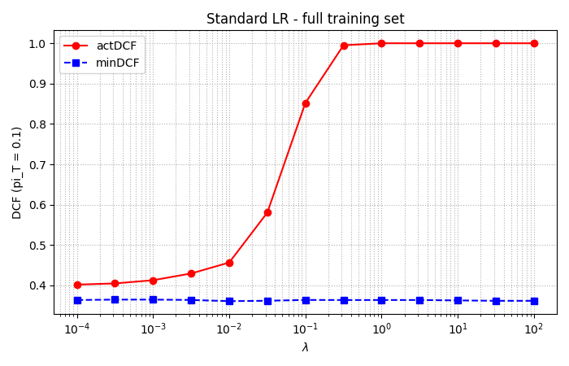

**Observation:** minDCF is essentially flat between ~0.361 and ~0.365
— regularization has no effect on separability because we have 4000
samples and only 7 parameters (6 + bias). actDCF instead blows up
with λ: the weights are "shrunk" and the prior offset
(`log(π_emp/(1-π_emp))`) is no longer enough to calibrate them; the
score loses its probabilistic interpretation.

### 6.4 Standard LR on the reduced dataset (1 sample out of 50 → 80 samples)

| λ | J*(w,b) | actDCF | minDCF |
|---:|---:|---:|---:|
| 1e-4 | 1.198e-1 | 0.9780 | 0.4466 |
| 1e-3 | 1.386e-1 | 0.7466 | 0.4487 |
| 1e-2 | 2.070e-1 | 0.4652 | 0.4407 |
| 3.2e-2 | 2.759e-1 | 0.4830 | 0.4147 |
| 1e-1 | 3.738e-1 | 0.7164 | 0.3988 |
| 3.2e-1 | 4.895e-1 | 0.9792 | 0.3888 |
| **1e+1** | 6.752e-1 | 1.0000 | **0.3783** |
| 3.2e+1 | 6.839e-1 | 1.0000 | 0.3793 |
| 1e+2 | 6.868e-1 | 1.0000 | 0.3783 |

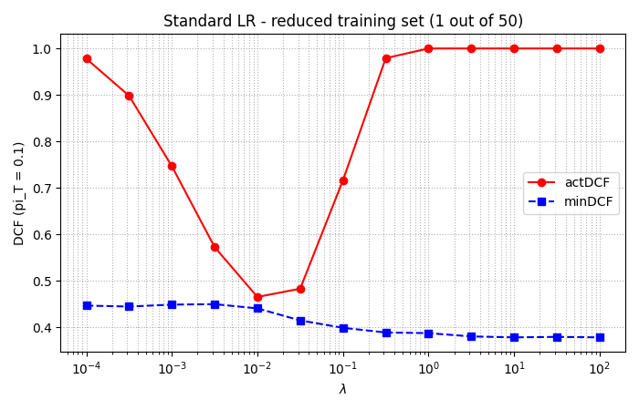

**Observation:** now regularization **is critical**. With no
regularization (small λ), the 80 samples cause overfitting → minDCF at
0.447. Increasing λ reduces overfitting → minDCF drops to 0.378. For
very large λ the model stays stable (no dramatic underfitting). actDCF
has a typical "U" shape.

### 6.5 Prior-weighted LR (π_T = 0.1, full DTR)

| λ | J* | actDCF | minDCF |
|---:|---:|---:|---:|
| 1e-4 | 1.296e-1 | 0.4071 | 0.3721 |
| 1e-3 | 1.343e-1 | 0.4129 | 0.3699 |
| 1e-2 | 1.643e-1 | 0.4487 | 0.3630 |
| **3.2e+1** | 3.246e-1 | 1.0000 | **0.3620** |

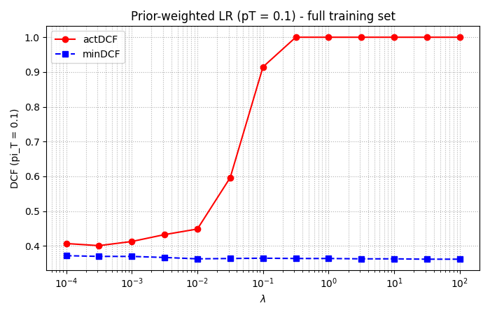

**Observation:** results almost identical to the non-weighted model
(best minDCF ≈ 0.362 vs 0.361). For this task there is **no
significant advantage** in the prior-weighted model: the dataset is
balanced (π_emp ≈ 0.5), so weight substitutions do not substantially
change the geometry of the problem. Additionally, prior-weighted
requires knowing π_T at training time: a practical disadvantage that
the non-weighted version avoids.

### 6.6 Quadratic LR (full DTR)

| λ | J* | actDCF | minDCF |
|---:|---:|---:|---:|
| 1e-4 | 1.514e-1 | 0.2768 | 0.2602 |
| 3.2e-4 | 1.535e-1 | 0.2656 | 0.2612 |
| 1e-3 | 1.596e-1 | 0.2765 | 0.2587 |
| 3.2e-3 | 1.752e-1 | 0.2771 | 0.2527 |
| 1e-2 | 2.086e-1 | 0.3464 | 0.2487 |
| **3.2e-2** | 2.686e-1 | 0.4972 | **0.2436** |
| 1e-1 | 3.595e-1 | 0.7520 | 0.2466 |
| 3.2e-1 | 4.717e-1 | 0.9623 | 0.2629 |

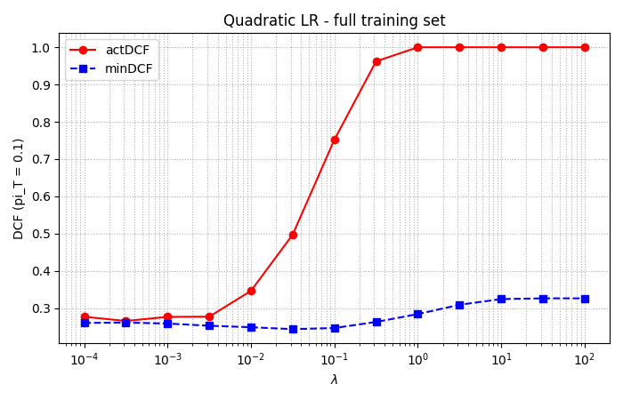

**Observation:** sharp qualitative jump compared with the linear model.
The best minDCF (0.244) is comparable to MVG (0.263). Regularization
**now matters**: with 42 parameters (vs 7) and small λ we see
overfitting (minDCF improves up to 3.2·10⁻²), then worsens again. The
quadratic space captures **feature 5-6 interactions** (the 4 clusters)
that the linear model cannot see.

### 6.7 Final comparison at target π_T = 0.1

| Model | actDCF | minDCF | hyper |
|---|---:|---:|---|
| Gaussian MVG | 0.3051 | 0.2629 | — |
| Gaussian Naive Bayes | 0.3022 | 0.2570 | — |
| Gaussian Tied | 0.4061 | 0.3628 | — |
| Standard LR (best λ) | 0.4568 | 0.3611 | λ=1e-2 |
| Prior-weighted LR (best λ) | 1.0000 | 0.3620 | λ=32 |
| **Quadratic LR (best λ)** | 0.4972 | **0.2436** | λ=3.2e-2 |

### 6.8 Answers to the Lab 7 project questions

- **Effect of λ on the full dataset:** negligible on minDCF
  (separability), critical for actDCF (calibration). For λ→∞ the
  weights collapse to zero and the score becomes a constant → DCF = 1.
- **Effect of λ on the reduced dataset:** classic bias/variance
  trade-off — regularization prevents overfitting in the few-samples
  regime.
- **Prior-weighted vs standard:** no advantage for this task (balanced
  dataset).
- **Quadratic LR:** halves the minDCF of all linear/MVG models,
  confirming that the problem has **non-linear separation**.
- **Comparison with Gaussian:**
  - Linear LR ≈ Tied Gaussian (both linear boundary): 0.361 vs 0.363.
  - Quadratic LR > MVG (both quadratic boundary): 0.244 vs 0.263.
    The difference is because quadratic LR is discriminative (maximizes
    the conditional log-likelihood) while MVG is generative (maximizes
    the marginal likelihood).
  - Naive Bayes is competitive because features are nearly
    uncorrelated.
- **Dataset characteristics picked up by the models:** the quadratic
  structure of features 5-6 and the different per-class variances.

---

## 7. Lab 8 — Support Vector Machines

### 7.1 Theoretical framework

**Linear primal SVM** (with the extended-feature trick to remove the
Σαᵢzᵢ=0 constraint):
\[ \hat{J}(\hat{w}) = \frac{1}{2}\|\hat{w}\|^2 + C\sum_i \max(0, 1 - z_i \hat{w}^T\hat{x}_i),\quad \hat{x} = [x; K] \]

**Dual:**
\[ \hat{L}^D(\alpha) = \frac{1}{2}\alpha^T \hat{H}\alpha - \alpha^T \mathbf{1},\quad 0 \le \alpha_i \le C \]
with `H_ij = z_i z_j (x_i^T x_j + K²)` in the linear case, or
`H_ij = z_i z_j (k(x_i, x_j) + ξ)` with a kernel.

**Recovering the primal:** `w* = Σ α_i z_i x_i`,
`b* = K · Σ α_i z_i`.

**Test-sample score:** `s(x) = Σ α_i z_i k(x_i, x) + ξ Σ α_i z_i`.

**Important:** SVM scores are **not LLRs**. actDCF is computed as if
they were, but we expect miscalibration (sometimes drastic). Only
minDCF is meaningful as a measure of separability.

**Kernels available in [models/svm.py](../models/svm.py):**
- Polynomial: `k(x₁, x₂) = (x₁^T x₂ + c)^d`. For `c=1` it implicitly
  includes the regularized bias; for `c=0` it does not.
- RBF: `k(x₁, x₂) = exp(−γ ||x₁ - x₂||²)`. Does not include bias → ξ=1.

### 7.2 Experiment setup

- Linear: C ∈ logspace(-5, 0, 11), K=1. Test on both original and
  centered data.
- Poly d=2, c=1, ξ=0, C ∈ logspace(-5, 0, 11).
- RBF: grid γ ∈ {e⁻⁴, e⁻³, e⁻², e⁻¹},
  C ∈ logspace(-3, 2, 11), ξ=1.
- (Optional) Poly d=4, c=1, ξ=0.

### 7.3 Linear SVM results (summary)

**Non-centered:**

| C | primal | dual | duality gap | actDCF | minDCF |
|---:|---:|---:|---:|---:|---:|
| 1e-5 | 4.0e-2 | -0e0 | 4e-2 | 1.000 | 1.000 |
| 1e-4 | 3.29e-1 | 3.29e-1 | 2.7e-9 | 1.000 | 0.364 |
| 1e-2 | 1.14e+1 | 1.14e+1 | 2.2e-4 | 0.673 | 0.363 |
| **3.2e-1** | 3.06e+2 | 3.06e+2 | 1.3e-2 | 0.495 | **0.358** |
| 1.0 | 9.63e+2 | 9.62e+2 | 5.5e-2 | 0.486 | 0.358 |

**Centered (DTR mean subtracted from DTR and DVAL):**

| C | primal | dual | actDCF | minDCF |
|---:|---:|---:|---:|---:|
| **1e-1** | 9.86e+1 | 9.85e+1 | 0.518 | **0.357** |

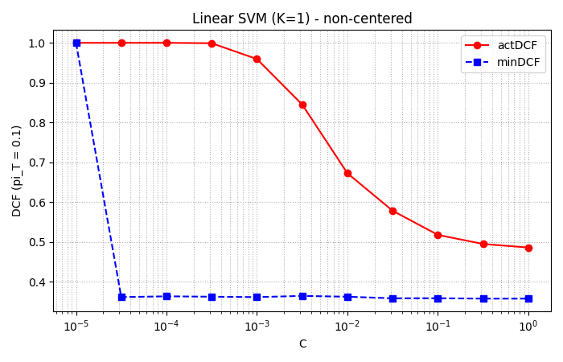

**Observation:** best minDCF ≈ 0.358 (slightly better than the linear
LR at 0.361). Centering does not substantially change the results (data
was already centered around zero). actDCF stays very high (≥ 0.49 at
best): the linear SVM is heavily miscalibrated for π_T = 0.1.

### 7.4 Polynomial kernel SVM (d=2, c=1, ξ=0)

| C | primal | dual | actDCF | minDCF |
|---:|---:|---:|---:|---:|
| 1e-5 | 4e-2 | 0 | 1.000 | 1.000 |
| 3.2e-5 | 1.08e-1 | 1.08e-1 | 1.000 | 0.246 |
| 1e-4 | 2.54e-1 | 2.54e-1 | 1.000 | 0.251 |
| 1e-3 | 1.28 | 1.28 | 0.920 | 0.257 |
| **3.2e-2** | 2.18e+1 | 2.18e+1 | 0.466 | **0.246** |
| 1e-1 | 6.37e+1 | 6.37e+1 | 0.408 | 0.249 |
| 1.0 | 6.03e+2 | 6.02e+2 | 0.389 | 0.258 |

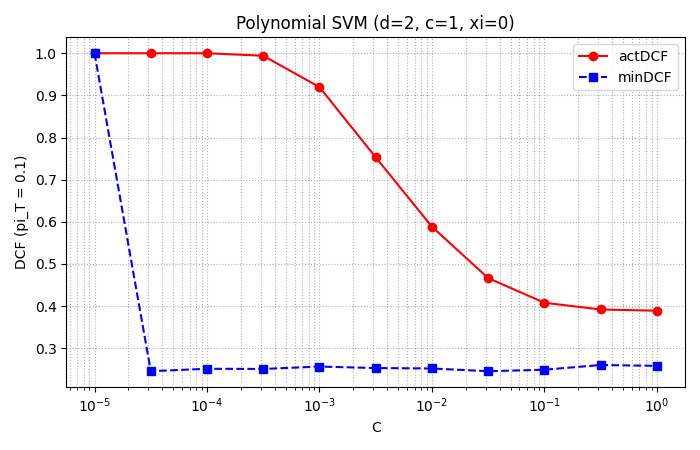

**Observation:** minDCF = 0.246 at best — comparable to quadratic LR
(0.244). The poly d=2 kernel essentially implements the same expanded
feature space as the Quadratic LR.

### 7.5 RBF kernel SVM (γ × C grid, ξ=1)

Sweep over 4 γ × 11 C = 44 models. Summary table (best row per γ):

| γ | C-best | minDCF-best | actDCF |
|---|---:|---:|---:|
| e⁻⁴ ≈ 0.018 | 10 | 0.241 | 0.314 |
| e⁻³ ≈ 0.050 | 3.2 | 0.239 | 0.467 |
| **e⁻² ≈ 0.135** | **32** | **0.173** | 0.423 |
| e⁻¹ ≈ 0.368 | 1.0 | 0.183 | 0.901 |

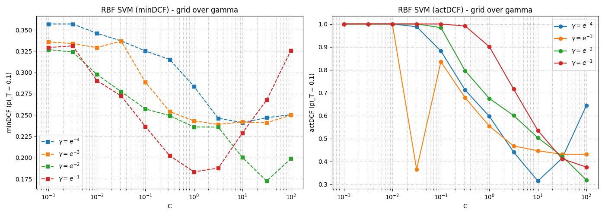

**Global best:** γ = e⁻² ≈ 0.135, C = 32, **minDCF = 0.1725**,
actDCF = 0.4226.

**Observation:** the RBF kernel is the first model in the whole
project to go below 0.20 minDCF. Its ability to draw non-parametric
decision boundaries captures the "cluster" structure of features 5-6
well.

### 7.6 (Optional) Poly d=4

| C | actDCF | minDCF |
|---:|---:|---:|
| 3.2e-3 | 0.320 | **0.177** |
| 1e-3 | 0.399 | 0.178 |

Poly d=4 reaches minDCF ≈ 0.177, close to the RBF best. Confirms that
the problem is well separated by high-degree polynomial surfaces,
because features 5-6 form a structure well approximated by
high-order cross products (cf. PDF hint: the product `y₅ y₆` on a
sample of a given quadrant distinguishes the four quadrants).

### 7.7 Final comparison (π_T = 0.1)

| SVM model | actDCF | minDCF | hyper |
|---|---:|---:|---|
| Linear (non-centered, best C) | 0.495 | 0.358 | C=0.32 |
| Linear (centered, best C) | 0.518 | 0.357 | C=0.1 |
| Poly d=2 (best C) | 0.466 | 0.246 | C=3.2e-2 |
| **RBF (best γ, C)** | 0.423 | **0.173** | γ=e⁻², C=32 |
| (opt) Poly d=4 (best C) | 0.320 | 0.177 | C=3.2e-3 |

### 7.8 Answers to the Lab 8 project questions

- **Linear SVM and regularization:** small C (strong regularization) →
  the model collapses, minDCF=1. Large C: minDCF stabilizes around
  ~0.358. Calibration always poor (actDCF >> minDCF).
- **Centered data:** no significant difference. Features were already
  zero-mean.
- **Comparison with linear LR and Tied:** essentially equivalent in
  minDCF (~0.36).
- **Polynomial d=2:** halves the minDCF compared with linear (0.246 vs
  0.358). Consistent with the fact that the features require quadratic
  boundaries. Calibration still poor (actDCF ≈ 0.47).
- **RBF:** best model in this family. γ controls kernel "width": too
  large (e⁻¹) → local overfit, minDCF degrades for large C; too small
  (e⁻⁴) → kernel almost flat, minDCF ≈ 0.24. The sweet spot
  (γ=e⁻²) is the best.
- **Score calibration:** all SVMs are miscalibrated on this
  application.
- **(opt) Poly d=4:** similar to RBF. The PDF hint links this choice
  to the geometric structure of the dataset: a degree-4 kernel can
  implement products like `y₅² y₆²` or `y₅ y₆` that separate the 4
  clusters in features 5-6 well.

---

## 8. Lab 9 — Gaussian Mixture Models

### 8.1 Theoretical framework

**GMM model:** mixture density of M Gaussians:
\[ f_X(x) = \sum_{g=1}^{M} w_g \mathcal{N}(x|\mu_g, \Sigma_g) \]
with `Σ w_g = 1`.

**EM algorithm** (in [models/gmm.py](../models/gmm.py)::`_em_iteration`):
- **E-step:** responsibilities
  `γ_{g,i} = P(G=g|x_i) = w_g N(x_i|μ_g, Σ_g) / f_X(x_i)`, computed in
  log-domain via `logsumexp`.
- **M-step:** statistics `Z_g, F_g, S_g` → update of
  `μ_g, Σ_g, w_g`.

**Covariance variants:**
- Full: no constraint.
- Diagonal: `Σ_g ← Σ_g ⊙ I` after M-step.
- Tied (all components share Σ within a GMM): `Σ ← Σ w_g Σ_g` after
  M-step.

**Eigenvalue thresholding (smooth_covariance_matrix):** constraint
`λ_min(Σ) ≥ ψ` (ψ=1e-2) to avoid degenerate solutions.

**LBG initialization:** starts from 1 Gaussian (ML estimate), then
doubles the number of components by splitting each along the leading
eigenvector direction (`d = U[:,0] · √s[0] · α`, with α=0.1) and
applies EM to the doubled GMM.

**LLR for binary classification:**
`llr(x) = log GMM_1(x) − log GMM_0(x)`.

### 8.2 Experiment setup

- For each class, K ∈ {1, 2, 4, 8, 16}. We explore **the full
  Cartesian product** 5×5 = 25 combinations (K₀ for fake, K₁ for
  genuine).
- ψ = 1e-2, α_LBG = 0.1, EM stopping criterion: Δ avg-ll ≤ 1e-6.
- Target: π_T = 0.1.

### 8.3 Full-covariance GMM results

**minDCF matrix (row K₀, column K₁):**

| | K₁=1 | K₁=2 | K₁=4 | K₁=8 | K₁=16 |
|---|---:|---:|---:|---:|---:|
| K₀=1 | 0.263 | 0.265 | 0.214 | 0.185 | **0.150** |
| K₀=2 | 0.218 | 0.216 | 0.223 | 0.186 | 0.170 |
| K₀=4 | 0.233 | 0.232 | 0.216 | 0.189 | 0.175 |
| K₀=8 | 0.176 | 0.181 | 0.196 | 0.179 | 0.153 |
| K₀=16 | 0.167 | 0.166 | 0.192 | 0.176 | 0.163 |

**Best Full GMM:** K₀=1, K₁=16 — **minDCF = 0.1495**, actDCF = 0.2055.

**actDCF matrix (row K₀, column K₁):**

| | K₁=1 | K₁=2 | K₁=4 | K₁=8 | K₁=16 |
|---|---:|---:|---:|---:|---:|
| K₀=1 | 0.305 | 0.305 | 0.237 | 0.196 | 0.206 |
| K₀=8 | 0.200 | 0.191 | 0.199 | 0.193 | 0.173 |
| K₀=16 | 0.178 | 0.175 | 0.192 | 0.205 | 0.177 |

### 8.4 Diagonal-covariance GMM results

**Best Diagonal GMM:** K₀=8, K₁=16 — minDCF = 0.1324, actDCF = 0.1487.

Curiously, **the Diagonal beats the Full** in minDCF and dramatically
in actDCF. The explanation:
- Features are **nearly uncorrelated** (Pearson < 0.05): the diagonal
  covariance assumption is nearly true for each component.
- A Diagonal GMM has fewer parameters → lower estimation variance →
  better generalization.
- Diagonal is also better calibrated (cal-loss 0.016 vs 0.056 for the
  Full).

### 8.5 Final best-of-family comparison at π_T = 0.1

| Family / Model | actDCF | minDCF |
|---|---:|---:|
| **GMM Full (K₀=1, K₁=16)** | 0.2055 | 0.1495 |
| GMM Diagonal (K₀=8, K₁=16) | 0.1487 | 0.1324 |
| LR quadratic (best λ) | 0.4972 | 0.2436 |
| LR linear (best λ) | 0.4568 | 0.3611 |
| SVM RBF (best γ, C) | 0.4226 | 0.1725 |
| SVM poly d=2 (best C) | 0.4664 | 0.2455 |

### 8.6 Bayes Error Plot (top-3 best-of-family)

The plot shows actDCF and minDCF as a function of
`prior log-odds ∈ [-4, +4]` for the three family winners:

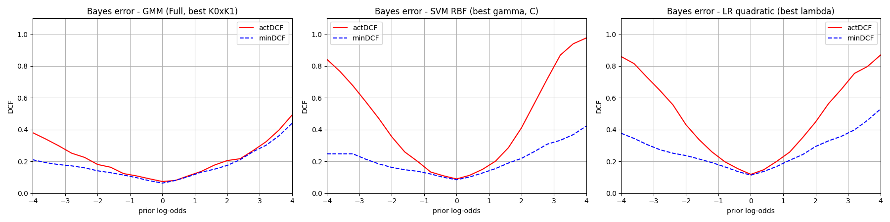

**Reading:**
- **GMM (left):** actDCF and minDCF very close (modest gap over the
  whole region). Well-calibrated model.
- **SVM RBF (center):** low minDCF (dashed blue line) but actDCF
  substantially higher in the tails: strong miscalibration for
  asymmetric applications (log-odds ±3).
- **LR Quadratic (right):** intermediate behavior. Calibrated near
  log-odds = 0 (π̃ ≈ 0.5, close to the empirical prior), worse at the
  extremes.

### 8.7 Answers to the Lab 9 project questions

- **Which K₀×K₁ combinations work best?**
  - The dominant pattern: increasing K₁ (components for the genuine
    class) improves minDCF up to K₁=16. Increasing K₀ has a modest,
    non-monotone benefit.
  - **The best is K₀=1, K₁=16** (full-cov): consistent with the dataset
    structure observed in §1. The fake class is essentially uni-modal →
    1 Gaussian is enough. The genuine class is multi-modal (4 clusters
    in features 5-6, with bimodality in those same features) → many
    components are needed.
  - Surprising results? Yes: one might have expected a symmetric K (e.g.
    8×8 or 16×16). Instead the **asymmetric model** wins, reflecting
    the intrinsic complexity of the two classes.
- **Comparison across methods (best per family):** GMM wins in minDCF
  (0.150 full / 0.132 diag), SVM RBF second (0.173), LR quadratic
  third (0.244), Gaussian baseline further (MVG ≈ 0.263).
- **Most promising model:** **GMM** is the winner. It combines:
  1. **Better separability** (lower minDCF).
  2. **Better intrinsic calibration** (actDCF close to minDCF), because
     GMM is generative and its LLR is a true ML density ratio.
- **Ranking consistent across applications (minDCF)?** Yes,
  essentially: GMM beats SVM beats LR across the whole log-odds curve
  [-4, +4].
- **Consistent actDCF ranking?** No: SVM has much worse actDCF than
  GMM in the tails (factor 2+); SVM should be **calibrated** for
  real-world applications (logistic regression on its scores, or
  cross-validation to pick an optimal threshold).

---

## 9. General discussion and conclusions

### 9.1 Summary of design choices

**Conventions adopted** (CLAUDE.md):
- Samples are **columns** of `D ∈ ℝ^(M×N)` with M=6, N=6000.
- Class 1 (genuine) on top of the ratio:
  `LLR = log p(x|1) − log p(x|0)`.
- Deterministic split (seed=0): 4000 training, 2000 validation.
- ML estimate always on DTR; transformations (PCA, LDA) **never**
  estimated on DVAL.
- Normalized DCF, theoretical threshold `t = -log(π_T/(1-π_T))` for
  actDCF.
- Plots in PNG (for the Markdown report); text logs mirrored to
  terminal and file via `utils/logger.py`.

### 9.2 Cross-lab comparison: model ranking (minDCF at π̃=0.1)

| Rank | Model | minDCF | Characteristics |
|---:|---|---:|---|
| 1 | **GMM Diagonal (8×16)** | **0.1324** | Non-parametric, generative, well-calibrated |
| 2 | GMM Full (1×16) | 0.1495 | Non-parametric, generative, well-calibrated |
| 3 | SVM RBF (γ=e⁻², C=32) | 0.1725 | Non-parametric, discriminative, miscalibrated |
| 4 | SVM Poly d=4 (opt) | 0.1767 | Polynomial discriminative, miscalibrated |
| 5 | LR Quadratic (λ=3.2e-2) | 0.2436 | Parametric quadratic discriminative |
| 6 | SVM Poly d=2 | 0.2455 | Quadratic discriminative, miscalibrated |
| 7 | Naive Bayes Gaussian | 0.2570 | Parametric generative, diagonal |
| 8 | MVG Full | 0.2629 | Parametric generative, full-cov |
| 9 | Tied Gaussian | 0.3628 | Parametric generative, linear boundary |
| 10 | LR linear / SVM linear | ≈0.36 | Linear discriminative |

### 9.3 Take-aways for an exam

1. **The Lab 2 exploratory analysis already predicts the winner.** The
   4 clusters in features 5-6 and the bimodality of the genuine class
   in those same features justify why a GMM with many components for
   genuine wins.

2. **Different model families have orthogonal strengths:**
   - **Parametric generative** (MVG, Naive, Tied): fast to estimate,
     output naturally calibrated as LLR, but the Gaussian assumption
     fails on features 5-6.
   - **Parametric discriminative** (LR): output calibrated as
     log-posterior; with feature expansion (quadratic) recovers MVG
     expressiveness and sometimes beats it.
   - **Non-parametric discriminative** (kernel SVM): maximum
     boundary flexibility, but non-probabilistic output → calibration
     needed.
   - **Non-parametric generative** (GMM): combines flexibility and
     automatic calibration, the sweet spot for this task.

3. **Relationship between models:**
   - Tied Gaussian ≈ LDA ≈ Linear LR ≈ Linear SVM: all produce a
     linear boundary. They differ only in the training criterion (ML,
     Fisher, max log-posterior, max margin).
   - MVG ≈ Quadratic LR ≈ Poly d=2 SVM: all quadratic boundary. Also
     here they differ by criterion.
   - K-component GMM ≈ kernel SVM with RBF: both model non-parametric
     boundaries, but GMM is generative and gives LLRs; SVM is
     discriminative and gives a raw score.

4. **Calibration vs separability (minDCF vs actDCF):**
   - **minDCF** measures the intrinsic quality of the sample *ranking*.
   - **actDCF** measures the quality of the *decisions* based on the
     theoretical threshold.
   - A model with low minDCF but high actDCF is a model that "can"
     classify but "cannot" decide → **calibration** is required
     (linear-LR on the scores, or an empirically chosen threshold).
   - Generative models (MVG, GMM) are usually better calibrated than
     discriminative ones (LR, especially SVM).

5. **PCA does not always help.** On this task it does not improve
   Gaussian models, and even slightly worsens Naive Bayes (introduces
   correlation in the new features). PCA is useful mainly when: (a)
   the dimensionality is high with noise; (b) we want to visualize.
   Here that is not the case.

6. **Regularization and dataset size:**
   - Full DTR (4000 samples, 7 LR-linear parameters): regularization
     irrelevant.
   - Reduced DTR (80 samples): regularization critical, classic
     bias/variance U-shape.
   - Full DTR + Quadratic LR (42 parameters): regularization useful
     again (sample/parameter ratio drops to ~95).

### 9.4 A natural extension: score calibration

For this project, models have been saved to disk (see
`out/lab07/`, `out/lab08/`, `out/lab09/gmm_full_best_llr.npy`)
precisely to be used in a future **calibration** lab (not yet brought
into the project). The flow would be:
1. Take the scores of an uncalibrated discriminative model (e.g. SVM
   RBF).
2. Fit a linear LR (`trainWeightedLogRegBinary` with target π_T) on the
   scores of a calibration subset.
3. Apply the affine transformation to the evaluation scores.
4. Compare actDCF before/after: we expect it to approach minDCF.

### 9.5 Possible future improvements (not implemented)

- **Score-level fusion:** combine LR quadratic + GMM + SVM RBF via
  averaging or a multi-input calibrator.
- **More aggressive cross-validation** for hyper-parameter selection.
- **Z-normalization** of features before SVM (marginal impact here,
  but standard in production).
- **PCA pre-processing for regularized LR** (the 42-D Quadratic LR
  could benefit from dimensionality reduction).
- **Tied-cov GMM** (shared covariances across components within the
  same class), not yet benchmarked as best-of-family.

---

## Appendix A — PDF Lab → Script → Output mapping

| Lab | PDF | Script | Text log | Plot dir |
|---:|---|---|---|---|
| 2 | [Iris_Dataset.pdf](../../Labs/2_Iris_Dataset/Iris_Dataset.pdf) | [lab02_iris_dataset.py](../experiments/lab02_iris_dataset.py) | [lab02_iris_dataset.txt](../out/lab02_iris_dataset.txt) | [plots/lab02/](../out/plots/lab02/) |
| 3 | [Dimensionality_Reduction.pdf](../../Labs/3_Dimensionality_Reduction/Dimensionality_Reduction.pdf) | [lab03_dimensionality_reduction.py](../experiments/lab03_dimensionality_reduction.py) | [lab03_dimensionality_reduction.txt](../out/lab03_dimensionality_reduction.txt) | [plots/lab03/](../out/plots/lab03/) |
| 4 | [Probability_Density_Estimation.pdf](../../Labs/4_Probability_Density_Estimation/Probability_Density_Estimation.pdf) | [lab04_density_estimation.py](../experiments/lab04_density_estimation.py) | [lab04_density_estimation.txt](../out/lab04_density_estimation.txt) | [plots/lab04/](../out/plots/lab04/) |
| 5 | [Generative_Gaussian_Models.pdf](../../Labs/5_Generative_Gaussian_Models/Generative_Gaussian_Models.pdf) | [lab05_gaussian_classification.py](../experiments/lab05_gaussian_classification.py) | [lab05_gaussian_classification.txt](../out/lab05_gaussian_classification.txt) | — |
| 6 | [BayesDecisionsModelEvaluation.pdf](../../Labs/6_Bayes_Decisions_Model_Evaluation/BayesDecisionsModelEvaluation.pdf) | [lab06_bayes_evaluation.py](../experiments/lab06_bayes_evaluation.py) | [lab06_bayes_evaluation.txt](../out/lab06_bayes_evaluation.txt) | [plots/lab06/](../out/plots/lab06/) |
| 7 | [LogisticRegression.pdf](../../Labs/7_Logistic_Regression/LogisticRegression.pdf) | [lab07_logistic_regression.py](../experiments/lab07_logistic_regression.py) | [lab07_logistic_regression.txt](../out/lab07_logistic_regression.txt) | [plots/lab07/](../out/plots/lab07/) |
| 8 | [SVM.pdf](../../Labs/8_Support_Vector_Machines/SVM.pdf) | [lab08_svm.py](../experiments/lab08_svm.py) | [lab08_svm.txt](../out/lab08_svm.txt) | [plots/lab08/](../out/plots/lab08/) |
| 9 | [GMM.pdf](../../Labs/9_Gaussian_Mixture_Models/GMM.pdf) | [lab09_gmm.py](../experiments/lab09_gmm.py) | [lab09_gmm.txt](../out/lab09_gmm.txt) | [plots/lab09/](../out/plots/lab09/) |

## Appendix B — Models and hyper-parameters used

| Model | Parameters | Hyper-param | Best value |
|---|---|---|---|
| MVG | μ_c (6×1), Σ_c (6×6) per c∈{0,1} — 12+72 total | — | — |
| Naive | as MVG but diag(Σ_c) | — | — |
| Tied | μ_c + global Σ | — | — |
| PCA | projection matrix (6×m) | m ∈ {1..6} | m=6 (no PCA) |
| LDA | 1-D direction | threshold | mean-of-means or sweep |
| Linear LR | w (6), b (1) | λ | 1e-2 (full), 10 (reduced) |
| Weighted LR | w, b | λ, π_T | π_T=0.1, λ=32 |
| Quadratic LR | w (42), b | λ | 3.2e-2 |
| Linear SVM | w, b | C, K | C=0.32, K=1 |
| Poly SVM | α (4000) | C, d, c, ξ | C=3.2e-2, d=2, c=1, ξ=0 |
| RBF SVM | α (4000) | C, γ, ξ | C=32, γ=e⁻²=0.135, ξ=1 |
| GMM Full | (w_g, μ_g, Σ_g) per g, c | K_0, K_1, ψ, α_LBG | K_0=1, K_1=16, ψ=1e-2, α=0.1 |
| GMM Diagonal | as Full but diag(Σ_g) | as Full | K_0=8, K_1=16 |

## Appendix C — Commands to reproduce the results

```bash
# Environment activation
source /home/nikcian/workspace/MPLR_Course/.venv/bin/activate
cd /home/nikcian/workspace/MPLR_Course/Project

# Run all labs sequentially
python experiments/lab02_iris_dataset.py
python experiments/lab03_dimensionality_reduction.py
python experiments/lab04_density_estimation.py
python experiments/lab05_gaussian_classification.py
python experiments/lab06_bayes_evaluation.py
python experiments/lab07_logistic_regression.py
python experiments/lab08_svm.py       # ~5-10 min for kernel SVMs
python experiments/lab09_gmm.py       # ~3-5 min for the 5x5 Full + 5x5 Diag grid
```

All scripts accept an optional argument for the dataset, default =
`data/trainData.txt`.

---

*End of report.*
